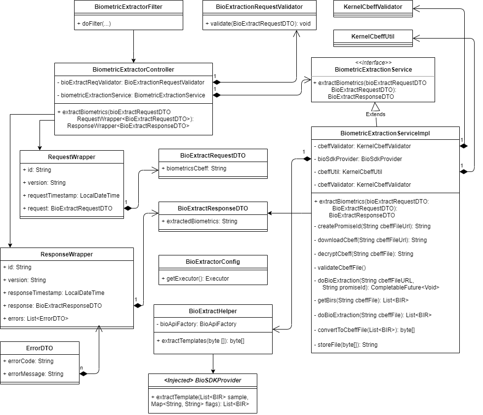
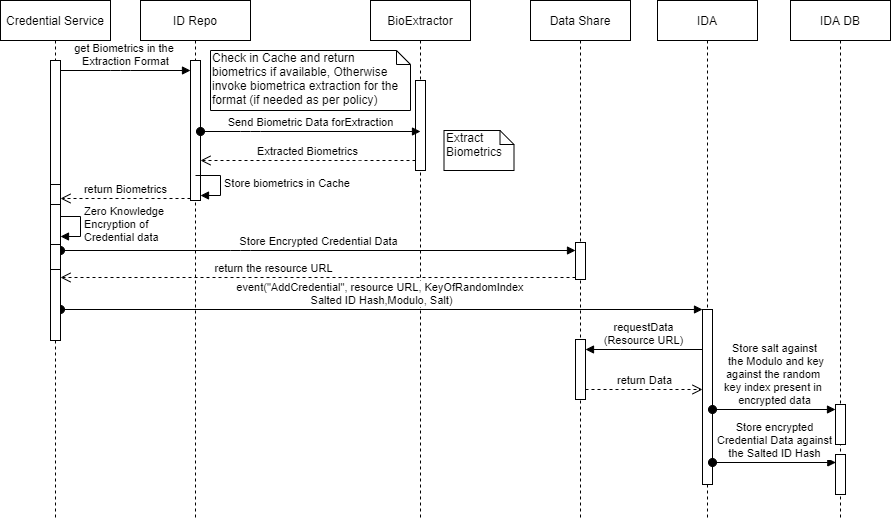

# Biometric Extractor Service

## 1. Background

In MOSIP, we capture various types of biometrics (iris, face and fingerprints) for performing biometric identifying if the resident is unique in the MOSIP system, biometric authentication of the resident or issuing a physical or digital credential to the resident. These biometrics that are captured can be of one format while when being used might be needed in a different format. We use an external extractor (SDK) to convert these biometric data from one format to another. 

This service will be used internally by MOSIP modules to extract desired format of biometrics with the help of SDKs based on a defined policy. 

### 1.1.Target Users
- ID Repository credential service

### 1.2. Key Functional Requirements  
- ID Repository credential service will request for biometrics from ID Repository for a particular partner (extracted/non-extracted based on the policy)

### 1.3. Key Non-Functional Requirements
-	Logging:
	-	Log all the exceptions along with error code and short error message
	-	As a security measure, Individual's UIN should not be logged
-	Audit:
	-	Audit all transaction details in database
	-	Individual's UIN should not be audited     
-	Exception:
	-	Any error in storing or retrieval of Identity details should be handled with appropriate error code and message in the response  
-	Security:    
	-	Individual's UIN should not be visible, and should be encrypted

## 2.	Solution    
The key solution considerations are
- TBD

### 2.1. Class Diagram

### 2.2. Sequence Diagram        
