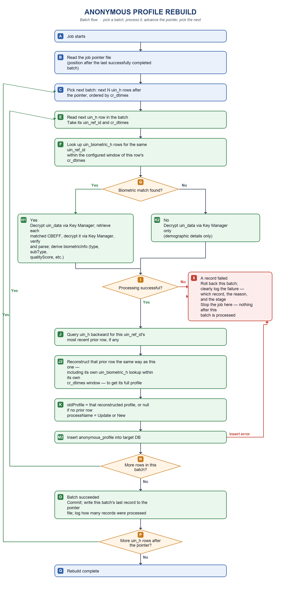

# Anonymous Profile Rebuild Batch Design

## Purpose

This document describes the current uin_h-driven reconstruction flow and a proposed resumable, transactional batch design for the anonymous-profile rebuild job.

The current job reads `idrepo.uin_h` from the source database in `cr_dtimes` order only; it is the sole iteration driver, and rows for different UINs interleave chronologically rather than being grouped. For each row, it looks up `idrepo.uin_biometric_h` for the same `uin_ref_id` within a configured time window(one or two minutes) to attach biometric details when a match exists. To determine `processName` and `oldProfile`, it searches `uin_h` backward from the current row for the most recent earlier row with the same `uin_ref_id`; if found, that row is reconstructed the same way — including its own `uin_biometric_h` lookup — to build `oldProfile`. If none exists, the row is the first entry for that UIN. It inserts completed events into the target `idrepo.anonymous_profile` table.

The proposed batch design aims to ensure that:

- Processing happens batch by batch, each batch a configurable number of records taken from the `cr_dtimes`-ordered `uin_h` stream.
- A batch is committed only if every event in it succeeds.
- A failure rolls back all target inserts for that batch.
- The job pointer is held in a single local pointer file — not a database.
- Restarting the job — including after an unexpected kill, crash, or unexpected close — resumes from the last successfully completed batch, because the job pointer only advances once a batch fully commits.
- On failure, the exact failing source row, the reason, and how many records the batch had already processed are clearly logged — not written to a database or a separate audit file.
- Every batch completion and every batch failure is logged, including the number of records processed.
- `oldProfile` is copied from the most recent successfully reconstructed event for the same `uin_ref_id`, found by searching backward through `uin_h` rather than relying on in-memory sequencing. Reconstructing that event repeats the full per-row process, including its own `uin_biometric_h` lookup — not just a re-read of its demographic data.

## Terminology

| Term | Meaning |
| --- | --- |
| Source record | A row from `idrepo.uin_h`, the sole driving stream. |
| Matched biometric record | A `idrepo.uin_biometric_h` row found for a source record's `uin_ref_id` within the configured time window; optional per source record. |
| Profile event | One reconstruction of a single `uin_h` row, demographic-only or demographic-plus-biometric. |
| Predecessor lookup | The backward query against `uin_h` for the most recent earlier row with the same `uin_ref_id`, used to build `oldProfile` and choose `New` or `Update`. Reconstructing that prior row repeats the full per-row process on it, including its own `uin_biometric_h` lookup within the matching window around its own `cr_dtimes` — the same way biometric details are constructed for the current row's `newProfile`. |
| Batch (job) | A configurable set of profile events taken in `cr_dtimes` order, initially targeted at 1,000 events. |
| Pointer file | A single local file — not a database — holding the job pointer. The only persisted state the job needs to resume. Written only when a batch succeeds; never touched on failure. |
| Job pointer (committed pointer) | Durable `(cr_dtimes, uin_ref_id, eff_dtimes)` position in the pointer file after the last completely committed batch. |
| In-job progress | The `uin_h` row ID of the event currently being processed within the active batch. Observational only — logged, never persisted to the pointer file or anywhere else. |
| Failed record | The `uin_h` row ID, batch, failure stage, and reason for the event that caused a batch to fail. Written to the log only — there is no failed-record table or file, and the pointer file is not touched. |

## Pointer File

The job pointer is stored in a single local file — not a database. This avoids standing up, migrating, and operating a separate checkpoint database purely to track one resume position; the file is the only persisted state the job needs.

Minimum content (a single small JSON file, one record):

```text
last_uin_ref_id
last_eff_dtimes
last_cr_dtimes
records_processed_in_last_batch
updated_at
```

The job reads this file at startup and overwrites it after each batch fully commits. Write it atomically — write to a temp file in the same directory, then rename over the pointer file — so a crash mid-write can never leave a corrupt or partially-written pointer file behind; a plain in-place write does not have that guarantee.

The pointer file is written **only** on a successful batch commit. It is never touched on failure — not even to record that a failure happened. A failure is entirely a log event (see Logging); the pointer file simply stays at whatever it was after the last successful batch, which is also what makes it the correct resume position after a failure.

**Location:** configurable via `rebuild.pointer-file.path`, defaulting to `./rebuild-job-pointer.json` relative to the job's working directory. Whatever path is configured must resolve to persistent storage that survives a process restart — not an ephemeral container filesystem that gets wiped between runs — since the pointer file is the job's only durable resume state. Standard file permissions apply: readable/writable only by the account the job runs as.

## External Dependencies: Object Store and Key Manager

Every row's reconstruction depends on two external components, neither of which is optional or has a fallback:

- The **object store** holds every matched biometric record's CBEFF object.
- **Key Manager** decrypts both the demographic `uin_data` and every fetched CBEFF object.

**Note:** Key Manager is a separate service, not an embedded library — the job connects to it over HTTP, authenticating through Auth Manager first to get a token, then calling Key Manager's decrypt endpoint per value. If either Key Manager or the object store is unreachable, every row's reconstruction fails and the job stops; there is no offline mode or cached-key fallback. Both must be verified reachable before running the job for real (see the README's Safety section).

### Object store

```properties
rebuild.object-store.bucket=idrepo
rebuild.object-store.endpoint=
rebuild.object-store.region=us-east-1
rebuild.object-store.access-key=
rebuild.object-store.secret-key=
rebuild.object-store.path-style-access=true
```

Leave `endpoint` blank for AWS's region-based S3 endpoint, or set it (e.g. to a MinIO URL) for an S3-compatible store. Leave `access-key`/`secret-key` blank to use the AWS default credential provider chain instead of static keys. Object key layout: `<uinHash>/Biometrics/<bioFileId>`.

### Key Manager

Key Manager decryption uses **one shared `applicationId`**, but **two different `referenceId`s** depending on what's being decrypted — this is the detail most likely to get mixed up:

| Data being decrypted | Config property | Sent as |
| --- | --- | --- |
| Demographic (`uin_h.uin_data`) | `mosip.idrepo.crypto.refId.uin-data` | `referenceId` |
| Biometric (each fetched CBEFF object) | `mosip.idrepo.crypto.refId.bio-doc-data` (code default: `biometric_data`) | `referenceId` |
| Both (shared) | `mosip.idrepo.app-id` | `applicationId` |

`mosip.idrepo.app-id` (Key Manager's `applicationId`, sent with every decrypt call) is a **different** registration from `mosip.authmanager.app-id` below (Auth Manager's `appId`, sent only when authenticating for a token) — similarly named properties, two different MOSIP components.

```properties
mosip.idrepo.app-id=
mosip.idrepo.crypto.refId.uin-data=
mosip.idrepo.crypto.refId.bio-doc-data=biometric_data

mosip.kernel.keymanager.decrypt-url=
mosip.kernel.keymanager.encrypt-url=
mosip.authmanager.token-url=
mosip.authmanager.client-id=
mosip.authmanager.client-secret=
mosip.authmanager.app-id=
```

This mirrors the README's Configuration section (`Object Store and Key Manager`); keep both in sync if these properties change.

## Current Source Ordering and Predecessor Lookup

The current source query reads active `uin_h` rows in this order only:

```sql
ORDER BY cr_dtimes ASC
```

`uin_h` is the sole iteration driver. Rows are not grouped by `uin_ref_id`; rows for different UINs interleave in strict chronological order.

For each ordered `uin_h` row, look up `uin_biometric_h` rows with the same `uin_ref_id` and the configured biometric file type whose `cr_dtimes` falls within the configured matching window of the `uin_h` row's `cr_dtimes`, before or after. If one or more match, retrieve each one's CBEFF object from the **object store**, decrypt it via **Key Manager**, verify its hash, and parse it — then combine the result with the demographic data, itself decrypted via Key Manager. If none match, the event is demographic-only. `uin_biometric_h` is never iterated independently of a `uin_h` row. See External Dependencies below for both components' configuration.

To determine `processName` and `oldProfile`, search `uin_h` backward from the current row for the most recent earlier row with the same `uin_ref_id`. If a prior row is found, reconstruct it the same way as the current row — including looking up `uin_biometric_h` for its own `uin_ref_id` within the matching window around its own `cr_dtimes`, independently of whatever the current row's biometric match was or wasn't — and copy that reconstructed profile exactly into `oldProfile`; `processName` is `"Update"`. If no prior row exists anywhere in the history, `oldProfile` is `null` and `processName` is `"New"`. This lookup is a direct database query, not an in-memory sequence, because rows for the same UIN are not contiguous in `cr_dtimes` order.

A failure while decrypting, matching, or reconstructing any event — including the predecessor lookup — stops the job without inserting that event.

`uin_h`'s primary key is `(uin_ref_id, eff_dtimes)` — confirmed from the identity-service's own entity mapping (`HistoryPK`), and globally unique by definition since it's a primary key. `uin_biometric_h` uses the same `HistoryPK` shape. That composite is added above as the tie-breaker for rows sharing an identical `cr_dtimes`; note `eff_dtimes` is a separate column from `cr_dtimes`, populated by its own independent timestamp call at insert time, so it cannot be assumed equal to `cr_dtimes` — it only serves here to make the ordering deterministic, not as a substitute value.

## Proposed Batch Ordering and Cursor

The proposed batch scan follows the single `uin_h` stream in `cr_dtimes` order. A batch is a fixed-size, contiguous slice of that stream — for example, the next 1,000 rows after the committed pointer — regardless of which UINs those rows belong to. A stable source row ID is needed to break `cr_dtimes` ties and to represent cursor positions precisely.

Because rows for the same UIN are not contiguous, the predecessor lookup for a row's `oldProfile` is not confined to the current batch: it queries `uin_h` directly and may resolve to a row committed in an earlier batch, or find no prior row at all. The pointer file therefore only needs to record the last committed `uin_h` position in the single stream — it does not need to track biometric-record consumption or pair assignments, since biometric matching is a per-row lookup with no state to resume. The pointer-file representation for a cursor position is `(cr_dtimes, uin_ref_id, eff_dtimes)`, matching the confirmed primary key tie-breaker above; this must still be validated against the real keyset-pagination implementation before it's built.

## Pointers

The job pointer is written to the pointer file, not a database, so its durability does not depend on the target batch transaction or on any checkpoint database being up.

### Job pointer (committed pointer)

The job pointer is the authoritative restart position.

- It identifies the last `uin_h` row of the last successfully committed batch.
- It is written to the pointer file only after the batch's target-database transaction has committed, with `records_processed_in_last_batch` set to the batch's record count.
- Its position is never advanced for a partially processed or failed batch — the file is simply not written to on failure at all (see Failure logging).
- Every update is logged: batch ID, records processed in that batch, and the new job pointer position.
- After a system restart, the job resumes from this position.

### In-job progress (log-only)

Progress within the currently executing batch is observable through logs, not through any persisted state — there is nothing to write to disk or a database per row.

- Log the `uin_h` row ID before processing each event.
- This is purely observational. It is never used as a restart position; only the job pointer, which advances solely after a full batch commits, is used to resume.

### Failure logging

On a failure:

1. Roll back the target-database batch transaction.
2. Clearly log the failure: the failing `uin_h` row (and its `uin_ref_id`), the batch, the failure stage, the reason, and how many records in that batch were already processed successfully before the failure. This log entry is the only record of the failure — there is no failed-record table or file.
3. Do not touch the pointer file. It stays exactly as it was after the last successful batch.
4. Stop the job.

Nothing automatically prevents the next run from starting — there is no `FAILED` flag to clear. The job simply resumes from the unchanged pointer position and reprocesses the same batch, which will fail again with the same log output until an operator resolves the underlying cause. Diagnosing and deciding when it's safe to rerun is done from the logs, not from any persisted status.

### Unexpected termination

If the process is killed, crashes, or otherwise closes unexpectedly mid-batch, no explicit recovery handling is required: the pointer file was last written at the end of the previous successfully committed batch, and nothing from the interrupted batch was written there. The next run reads that unchanged pointer and reprocesses the interrupted batch from its start. Logged in-job progress from the killed run is just log history — there is no stale persisted state to clean up.

## Proposed Batch Execution Flow

The core shape is simple: pick a batch, process every row in it, and only after the whole batch succeeds does the job pointer move to that batch's last record — then the next batch is picked. Any single record failure stops the job immediately, right there; there is no retry loop and no further batch runs. This matches `Anonymous_Profile_rebuild_updated.png`.

The per-record reconstruction steps (biometric-window lookup, decrypt, predecessor lookup, `oldProfile`/`newProfile`, insert) are unchanged from the single-stream flow described above. Per-row progress is logged only, not persisted (see In-job progress above), so it has no box of its own in the diagram.



## Proposed Transaction Rules

For every batch, use one target-database transaction for the profile inserts, and a separate write to the local pointer file for the job pointer.

On success:

1. Insert one anonymous profile for each successfully reconstructed event in the batch.
2. Commit the target-database transaction.
3. Write the job pointer to the pointer file: position = the batch's final `uin_h` row, `records_processed_in_last_batch` = the batch's record count.
4. Log the batch's record count and new job pointer.

If any event fails — during the predecessor lookup, decryption, profile construction, or insertion:

1. Roll back the target-database transaction. No batch inserts from it exist afterward.
2. Clearly log the failure: which record failed, the reason, the stage, and how many records in the batch were already processed successfully before the failure.
3. Do not write to the pointer file. It stays at its previous value.
4. Stop the job and return a failure result.

Nothing is cleared before the job runs again — there is no pointer-file flag to reset. The next run reads the unchanged job pointer and retries the entire failed batch from there.

Because the target-database commit and the pointer-file write are not one atomic operation — one is a database transaction, the other a file write — a crash between them is a known gap; see Open Implementation Decisions.

## Logging

Logging is the only record of what happened to a failed row — there is no failed-record table or file (see Pointer File). Two events are always logged:

- **Batch completed**: batch ID, number of records processed in the batch, and the job pointer's new position.
- **Batch failed**: batch ID, number of records processed in the batch before the failure, the failing `uin_h` row ID (and its `uin_ref_id`), the failure stage, and the reason — logged before the job stops, so an operator can find and act on it from logs alone.

Allowed `failure_stage` values for the logged failure:

```text
DECRYPTION
BIOMETRIC_MATCH
PREDECESSOR_LOOKUP
PROFILE_BUILD
INSERT
POINTER_FILE_WRITE
COMMIT
```

Logs must not include decrypted demographic data, raw biometric data, credentials, or production identifiers, matching the Failure Handling rule in the README.

## Building oldProfile and newProfile

The source history events are the source of truth. Do not query the growing `anonymous_profile` table to find the preceding profile, and do not rely on an in-memory "previous event" — because `uin_h` rows are processed in pure `cr_dtimes` order, rows for the same UIN are not contiguous.

For every `uin_h` row, after it reconstructs successfully, query `uin_h` backward for the most recent row with the same `uin_ref_id` and an earlier `cr_dtimes`.

If no such row exists, build:

```json
{
  "processName": "New",
  "oldProfile": null,
  "newProfile": {}
}
```

If a prior row exists, reconstruct it the same way — demographic data, plus biometric data if a matching `uin_biometric_h` record exists for it — and copy that result exactly into `oldProfile`:

```json
{
  "processName": "Update",
  "oldProfile": {},
  "newProfile": {}
}
```

`newProfile` contains only the current row's own details: demographic fields alone, or demographic fields plus `biometricInfo` when a matching biometric record was found for this row. No fields from any other row are carried into `newProfile`.

A failure during the predecessor lookup, decryption, CBEFF reconstruction, profile building, or insertion stops processing for that row; it does not get treated as any later row's predecessor. Because the predecessor lookup is a direct database query rather than in-memory state, a restart or batch boundary needs no special handling to preserve it — each row resolves its own predecessor independently, whether that predecessor was committed in an earlier batch, in the current batch, or is absent entirely.

## Proposed Performance Requirements

- Do not load the full `uin_h` table into memory.
- Use keyset pagination on `cr_dtimes` (plus the stable row ID tie-breaker); do not use `OFFSET`.
- Fetch only the configured batch size.
- The predecessor lookup is one indexed query per row, not a scan; do not batch-preload predecessors speculatively.
- Ensure `uin_h` has an index supporting the driving scan order:

```sql
(cr_dtimes, uin_ref_id, eff_dtimes)
```

- Ensure `uin_h` has an index supporting the predecessor lookup — same `uin_ref_id`, most recent `cr_dtimes` below a given value:

```sql
(uin_ref_id, cr_dtimes DESC)
```

- Ensure `uin_biometric_h` has an index supporting the per-row matching-window lookup. The lookup filters on `biometric_file_type` too (see Current Source Ordering above), so it belongs in the index — `(uin_ref_id, cr_dtimes)` alone would still make Postgres scan every file type for that UIN and filter the type as a row filter instead of through the index:

```sql
(uin_ref_id, biometric_file_type, cr_dtimes)
```

- All three queries also filter on `is_deleted` (only "active" rows are read). None of the three index definitions above include it, because whether that's worth a composite column or a partial-index predicate (`WHERE is_deleted IS NOT TRUE`, or whatever Postgres can actually prove matches the query's `COALESCE(...)`) depends on what fraction of rows are actually deleted in production — confirm with `EXPLAIN ANALYZE` against real data before deciding, per the README's Database Indexing section.
- These column names are confirmed against the identity-service's real schema (`uin_ref_id`, `cr_dtimes`, `eff_dtimes`, `biometric_file_type`) — see the primary-key note above.
- Process source data directly; avoid querying the growing target table for prior-profile lookup.

## Duplicate-Write Prevention During Rebuild

While the rebuild runs, the application's own live anonymous-profile creation must not write to the same table the rebuild job is writing to at the same time — otherwise the two can produce overlapping or duplicate profile records. Two alternative strategies prevent this. **Pick one** — they solve the same problem in incompatible ways, and running both doesn't compose; Strategy B reuses Strategy A's switch, but on a completely different timeline, described below.

Both strategies share these common steps regardless of which is chosen:

1. Acquire an exclusive rebuild lock so only one rebuild job can run.
2. Process batches using the job-pointer and rollback rules described earlier in this document.
3. When no records remain after the job pointer, mark the rebuild as completed.

### Strategy A: Application-Side Build Switch

The rebuild job writes directly into the live `idrepo.anonymous_profile` table. Because both the application and the rebuild job would otherwise write to that same table at the same time, the application's own profile-building must be switched off for the **entire** rebuild — from before the first batch starts until the last batch commits. For a large historical backfill this can mean the application cannot create new anonymous profiles in real time for a long window.

Introduce a centrally managed boolean configuration property:

```text
anonymous-profile.application-build.enabled
```

Expected behaviour under Strategy A:

| Job state | `anonymous-profile.application-build.enabled` |
| --- | --- |
| Before the rebuild starts | `false` |
| While any rebuild batch is running | `false` |
| A batch fails or the job stops before completion | `false` |
| All eligible `uin_h` rows are processed successfully | `true` |

Job flow (in addition to the common steps above):

- Set `anonymous-profile.application-build.enabled=false` before starting batch processing.
- Set `anonymous-profile.application-build.enabled=true` only after the rebuild reports completion, then release the rebuild lock.

The switch must not be enabled merely because one batch succeeds — only after the complete rebuild has finished successfully. If the process stops, crashes, or a batch fails, the switch remains disabled; an operator must resolve the failure and rerun the job, and the switch is enabled only once the job reaches the end of the source history.

### Strategy B: Target Table Cutover

The rebuild job writes into a separate shadow table instead of the live one, so the live `idrepo.anonymous_profile` table — and the application's own writes to it — are **unaffected for almost the entire rebuild**. Strategy A's switch is still used here, but only to cover the brief cutover window at the very end, not the whole rebuild; if using Strategy B, disregard Strategy A's "while any rebuild batch is running → `false`" row above, since that describes Strategy A's timeline, not this one.

Job flow (in addition to the common steps above):

1. Create `idrepo.anonymous_profile_rebuild` with the same schema as `idrepo.anonymous_profile`.
2. Run the batch job inserting into `idrepo.anonymous_profile_rebuild` instead of the live table. The live table keeps serving the application's normal reads and writes throughout.
3. When the job pointer indicates the rebuild has reached roughly 95% of the eligible `uin_h` rows, set `anonymous-profile.application-build.enabled=false` so no further application writes land on the live table.
4. Let the job continue running with live traffic paused until the job pointer reaches the end of the source history (100%), not just 95%. The 95% mark is only the signal to pause writes early enough that the remaining few percent finishes without racing new source rows — it is not itself a valid cutover point, since this design has no delta/backfill pass for rows the job hasn't reached yet.
5. Once the job reports completion, verify record counts and a sample of reconstructed profiles between `idrepo.anonymous_profile` and `idrepo.anonymous_profile_rebuild`.
6. Perform the cutover inside a single transaction so the swap is atomic:

   ```sql
   BEGIN;
   ALTER TABLE idrepo.anonymous_profile RENAME TO anonymous_profile_archive;
   ALTER TABLE idrepo.anonymous_profile_rebuild RENAME TO anonymous_profile;
   COMMIT;
   ```

7. Keep `idrepo.anonymous_profile_archive` as an archive of the pre-rebuild table rather than dropping it, until the rebuilt table has been validated in production.
8. Set `anonymous-profile.application-build.enabled=true` and resume live traffic, then release the rebuild lock.

A `RENAME` in PostgreSQL is a catalog-only metadata change, not a data copy, so the rename itself is near-instant; the traffic pause exists to guarantee no writer is mid-transaction against either table name when the swap happens, not to cover the rename's own duration.

## Restart Behaviour

The job pointer position below lives in the local pointer file (see Pointer File). There is no status field and nothing to clear — the pointer file only ever moves forward on success, so its position alone is enough to determine what happens next.

| Situation | Job pointer position | Next job action |
| --- | --- | --- |
| Batch completed | Moves to final row of the batch | Fetch rows after the new pointer |
| Record fails during a batch | Unchanged — the pointer file is not touched | Job stops; the failure is in the logs. The next run reads the unchanged pointer and retries the same batch — it will fail again the same way until the underlying cause is fixed. |
| Process killed, crashed, or closed unexpectedly mid-batch | Unchanged (last successful batch) | Retry the interrupted batch from its beginning |
| Process stops after commit | Advanced | Continue after the committed batch |
| No pointer file exists | Empty / null | Treat as a first run and fetch from the start |

## Open Implementation Decisions

1. Decide whether batches must strictly contain at most 1,000 records or may extend to complete a final row's transaction boundary.
2. Define retry policy for transient Key Manager failures.
3. Define how sensitive plaintext and error details are redacted from logs.