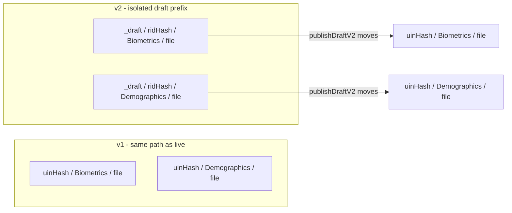
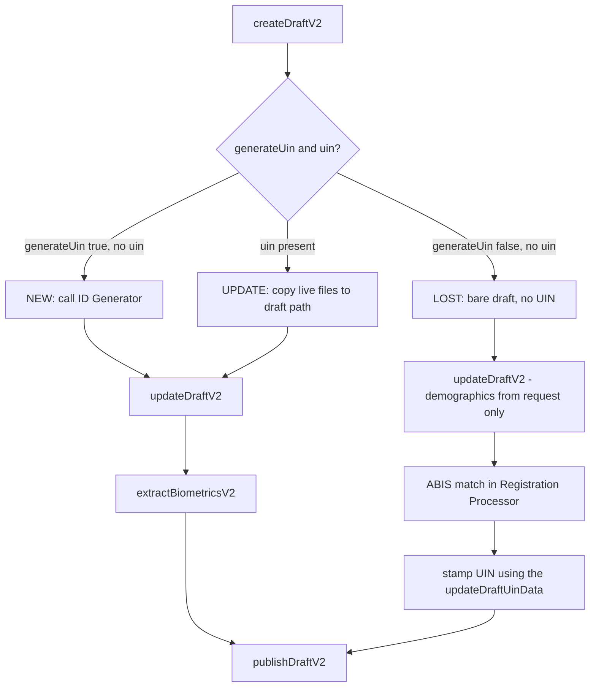
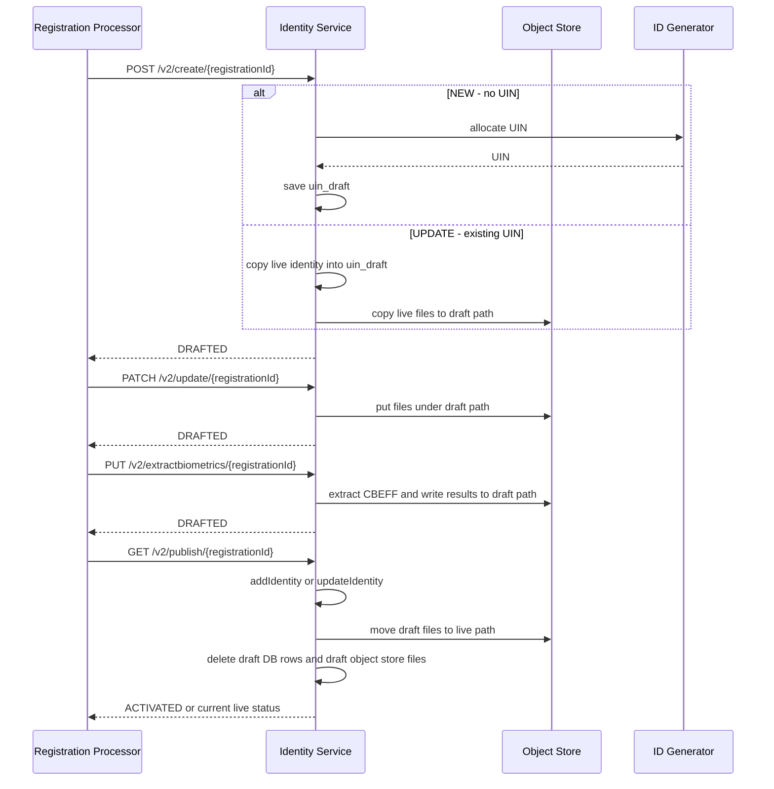
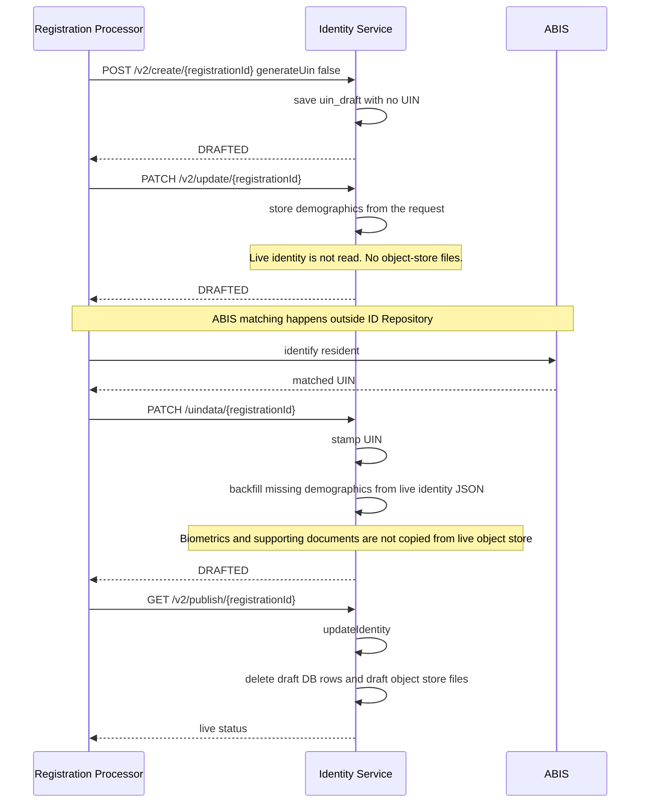

# Draft API Behavioral Changes

Identity Service now exposes a **v2** version of the Draft APIs. Registration Processor is the primary consumer.

Draft APIs are used while a registration packet is still being processed. Registration Processor writes the resident's demographics, biometrics, and supporting documents into ID Repository as a **draft**. That data becomes a live identity only when the draft is published.

v2 changes two behaviours compared with v1:

* **Object-store isolation.** Draft biometric and demographic files are stored under a separate draft path. They are not written on the live identity path until publish.
* **Optional UIN at create.** A draft no longer needs a UIN when it is created. This is required for LOST packets, because the resident's UIN is known only after ABIS matching. The UIN is stamped on the draft later, then the draft is published.

---

## What changed from v1

In v1, two constraints shaped how drafts worked:

* **Same object-store path as live identity.** Draft biometric and demographic files were written under `{uinHash}/Biometrics/...` and `{uinHash}/Demographics/...` — the same location as the published identity. While a packet was still in progress, those files could overwrite live data or sit next to it. If processing then failed or the packet was rejected, the draft files were already on the live path and remained there.
* **UIN required at create.** A draft could not be created without a UIN. A LOST packet therefore could not be stored in ID Repository until ABIS had matched the resident and returned a UIN.

v2 addresses both:

* Draft files are stored under a separate prefix keyed by registration ID (`_draft/{ridHash}/...`). They move to the live path only on publish. If the packet fails or is rejected, discard removes the draft files; the live identity path is not left with unpublished data.
* A draft can be created without a UIN. For LOST packets, the UIN is stamped later (after ABIS), and then the draft is published.

---

## APIs — before and after

v1 endpoints are unchanged. v2 adds a parallel set. `hasDraft` and `getDraftUIN` are unversioned and apply to both.

| Operation | v1 | v2 |
|---|---|---|
| Create | `POST /create/{registrationId}` | `POST /v2/create/{registrationId}` |
| Update identity / files | `PATCH /update/{registrationId}` | `PATCH /v2/update/{registrationId}` |
| Stamp UIN (LOST only) | — | `PATCH /uindata/{registrationId}` |
| Publish | `GET /publish/{registrationId}` | `GET /v2/publish/{registrationId}` |
| Discard | `DELETE /discard/{registrationId}` | `DELETE /v2/discard/{registrationId}` |
| Get | `GET /{registrationId}` | `GET /v2/{registrationId}` |
| Extract biometrics | `PUT /extractbiometrics/{registrationId}` | `PUT /v2/extractbiometrics/{registrationId}` |
| Exists? | `HEAD /{registrationId}` | same (unversioned) |
| Drafts for a UIN | `GET /uin/{UIN}` | same (unversioned) |

`PATCH /uindata/{registrationId}` is not under `/v2/`, but it belongs to the v2 flow only.

---

## Object-store location

Draft files and live files now live in different prefixes. `ridHash` is SHA-256 of the registration ID.

| Kind | Object-store path |
|---|---|
| Live identity | `{uinHash}/Biometrics/{file}` and `{uinHash}/Demographics/{file}` |
| v2 draft | `_draft/{ridHash}/Biometrics/{file}` and `_draft/{ridHash}/Demographics/{file}` |

v1 drafts use the live identity path. v2 drafts use the draft path until publish.

| Operation | v1 | v2 |
|---|---|---|
| Create (UPDATE packet) | Copies identity metadata in the DB. Files stay on the live path. | Copies live files into the draft path. Live files are not changed. |
| Update | Writes biometric and demographic files onto the live path. | Writes biometric and demographic files onto the draft path. |
| Get / Extract biometrics | Reads files from the live path. | Reads files from the draft path. Extracted templates are written back to the draft path. |
| Publish | Deletes draft DB rows. Files are already on the live path, so nothing is moved. | Moves files from the draft path to the live path, then deletes draft DB rows. |
| Discard | Deletes draft DB rows. Files on the live path are not removed. | Deletes files on the draft path, then deletes draft DB rows. |

v2 publish and discard delete object-store files **before** dropping the DB record, so a storage failure leaves the draft recoverable.

---

## Do not mix v1 and v2

A draft created or updated with one version must be finished with the **same** version. The two families look up files in different places.

What goes wrong if they are mixed:

* **Create v2, then get / extract / publish v1** — v1 reads the live `uinHash` path. v2 wrote under `_draft/{ridHash}/`. Files are not found, or live data is returned instead of the draft.
* **Create v1, then get / extract / publish v2** — v2 reads `_draft/{ridHash}/`, which was never written.
* **Discard v1 after a v2 create** — DB rows are removed; files under `_draft/{ridHash}/` are left behind.
* **Publish v1 after a v2 update** — identity DB may be committed, but draft files are not moved to the live path.

`HEAD /{registrationId}` and `GET /uin/{UIN}` only consult the database, so they work for either version. They do not make the object-store mismatch safe.

---

## Packet flows with v2 Draft APIs

### NEW / UPDATE

For a NEW packet, Identity Service calls the **ID Generator** API to allocate a UIN. ID Generator is not called for UPDATE; the existing UIN from the request is used.

### LOST

UIN is unknown at create time. `uin` and `uin_hash` on `uin_draft` are nullable so this draft can be saved before ABIS matching. Publish requires the UIN to be stamped first with `/uindata`.

`PATCH /v2/update/{registrationId}` stores only the **demographic data from the request**. It does not read the live identity. Nothing is written or copied in object store at this step, because the UIN is not known and the live path cannot be resolved.

`PATCH /uindata/{registrationId}` stamps the matched UIN and backfills **missing demographic fields** from the live identity JSON. Draft demographic values win on conflict. This backfill does not copy biometric or supporting-document files from the live object store. Live-to-draft file copy is also not done during updateDraftV2 for LOST (UIN is still unknown), so document and biometric updates are not possible. Only a demographics update is possible for a LOST UIN.

---

## Important notes

### Use one API version for the whole draft

* Use only v1 or only v2 for create, update, extract, publish, and discard of a given registration ID. Do not mix them.

### LOST packet needs a UIN before publish

* Stamp the UIN with `/uindata` before calling publish.

### Reprocessing a packet

* A RID can be reprocessed only when it is still the latest RID on the live identity. An older RID is not allowed.

### One active draft per UIN

* Several LOST drafts can exist at the same time while they have no UIN. After a UIN is stamped, only one draft can hold that UIN.

### Retrying a failed publish

* If publish fails while moving files to the live path, the draft DB record is left in place so the same publish can be retried. Files already moved on an earlier attempt are skipped.

---

## New error codes

| Code | When |
|---|---|
| `IDR-IDC-015` | Publish v2 when the draft has no UIN or no identity data |
| `IDR-IDC-016` | Create when the RID is older than the latest processed RID |
| `IDR-IDC-017` | `/uindata` when the UIN is not in the live `uin` table |
| `IDR-IDC-018` | `/uindata` when the draft is already stamped with a different UIN |
| `IDR-IDC-019` | Object-store move from draft path to live path failed |
| `IDR-IDC-020` | Object-store delete of draft files failed |
