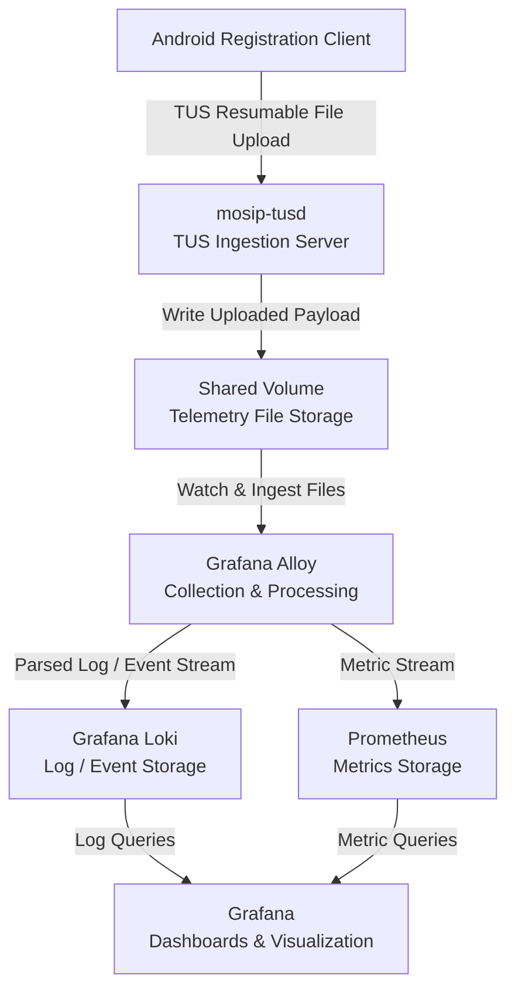
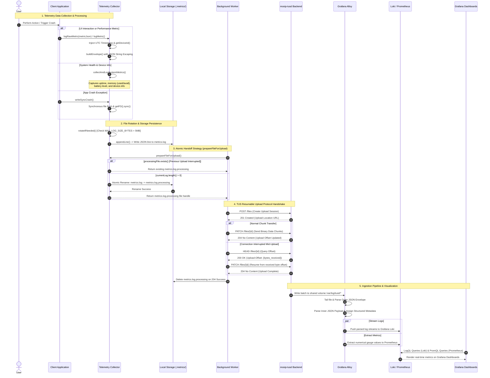
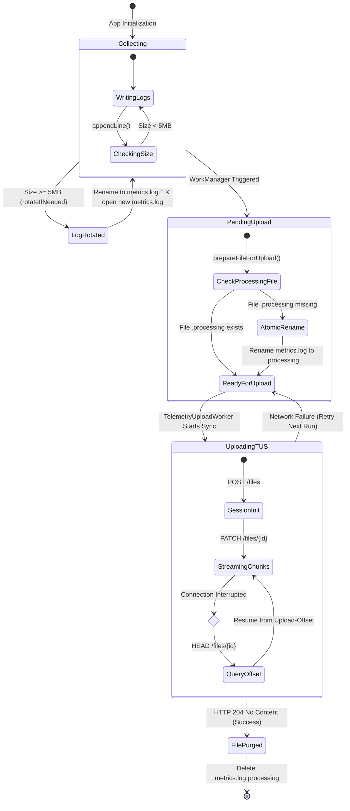

# Telemetry System Design Specification

| Field | Details |
| :--- | :--- |
| **Document Version** | `v1.0.0` |
| **Last Updated** | `12-09-2026` |
| **Target Repository** | `https://github.com/mosip/tusd-server  https://github.com/mosip/android-registration-client`|
| **Related Issues & PRs** | `https://github.com/mosip/android-registration-client/issues/719` |

---

## 1. Executive Summary & Objectives

### 1.1 Background
Currently, the Flutter-based Android Registration Client (ARC) operates with limited operational visibility into field operations, user interactions, and runtime health. Without a structured telemetry pipeline, detecting performance bottlenecks, monitoring application crashes, and identifying usability issues in distributed or offline field environments requires manual debugging and issue reporting.

### 1.2 Objective
The primary objective of this telemetry system is to establish an end-to-end, resilient, and non-blocking observability framework for the Android Registration Client. The architecture enables real-time collection of client metrics, secure batch synchronization over the TUS protocol, and centralized analysis using a cloud-native observability stack (**Grafana Alloy + Loki + Prometheus**).

### 1.3 Core Capabilities
- **Offline-First Non-Blocking Collection:** Asynchronous background event logging via the Pigeon Bridge and an Android Native Collector with automatic thread-safe 5MB file rotation (`metrics.log`).
- **Resumable & Efficient Transmission:** Periodic, network-aware sync executed by Android `WorkManager` pushing log batches over the TUS protocol (`mosip-tusd`).
- **Decoupled Ingestion Architecture:** High-throughput backend ingestion utilizing **Grafana Alloy** for parsing, routing log streams to **Grafana Loki**, and extracting numerical time-series metrics to **Prometheus**.
- **Centralized Observability & Visualization:** Operational monitoring through unified **Grafana Dashboards**, providing real-time queries via LogQL (for logs) and PromQL (for metrics) alongside automated alerting.
- **Privacy & Compliance Governance:** Built-in client-side data sanitization and opt-in user consent enforcement to safeguard personal identifiable information (PII).

### 1.4 Scope
- **Client Event Collection:** UI interaction tracking, navigation flows, and registration journey metrics across Flutter and Android native layers.
- **System Health Monitoring:** Application startup latency, CPU/memory consumption, battery status, and unhandled crash exception reports.
- **Local Resilience & Sync:** Non-blocking thread-safe local file logging, 5MB log rotation strategy, and network-aware background uploads via Android `WorkManager`.
- **Ingestion & Analytics:** Backend ingestion handling through `mosip-tusd`, pipeline parsing via Grafana Alloy, and storage in Grafana Loki (log streams) and Prometheus (metrics).
- **Visualization:** Production Grafana dashboards using LogQL and PromQL queries.

### 1.5 Non-Goals
- **Synchronous Real-Time Streaming:** Log uploads do not block main thread UI execution or require real-time websocket connections.
- **Raw PII/Biometric Storage:** Unmasked Personally Identifiable Information (PII) or biometric payload data will strictly never be logged or transmitted.
- **Long-Term On-Device Archival:** Local mobile storage acts solely as a temporary queue; log files are purged locally upon successful backend upload confirmation.

## 2. System Architecture & Flow Diagrams

### 2.1 High-Level Architecture
This diagram illustrates the end-to-end telemetry architecture, tracing data flow from the Flutter Android Registration Client through TUS protocol background upload to backend ingestion via Grafana Alloy, Loki, Prometheus, and Grafana dashboards.


### 2.2 Telemetry Collection Sequence
This sequence diagram details the step-by-step lifecycle of telemetry events, covering client event capture, atomic file rotation and handoff (metrics.log.processing), TUS resumable upload synchronization, and downstream log/metric parsing



### 2.3 Telemetry File Lifecycle

The local file queue on the mobile client transitions through distinct states to ensure thread safety, prevent data loss during upload failures, and enforce strict disk usage limits.



## 3. Technical Specifications & Payload Schemas

The telemetry system collects operational metrics, application events, and crash logs directly from the native `AndroidMetricCollector`. Telemetry items are serialized locally, wrapped in a uniform Logback-compatible outer envelope, and appended to `.metrics/metrics.log` prior to TUS batch upload.

---

### 3.1 Integrated Telemetry Payload Schema

Below is the complete JSON envelope structure as stored in `metrics.log`. The outer object maintains Logback metadata, while the inner stringified JSON payload carrying metric, event, or crash data is escaped within the `message` field.

```json
{
  "@timestamp": "2026-09-10T12:49:51.497+05:30",
  "@Version": "1",
  "message": "{\"@timestamp\":\"2026-09-10T07:19:51.493Z\",\"name\":\"app.crash\",\"type\":\"event\",\"device_model\":\"22031116AI\",\"error_type\":\"FlutterError\",\"message\":\"This widget has been unmounted, so the State no longer has a context (and should be considered defunct).\",\"stack_trace\":\"#0 State.context...\\n#1 State.context...\",\"screen\":\"HomePage\",\"fatal\":true}",
  "logger_name": "io.mosip.registration_client.telemetry.AndroidMetricCollector",
  "thread_name": "android-metrics-publisher",
  "level": "INFO",
  "level_value": 20000,
  "machine": "xJBPYGE5UOuk"
}
```

---

### 3.2 Data Dictionary & Field Specifications

| **Scope**           | **Key Name**            | **Data Type**         | **Required** | **Description / Allowed Values**                                                          |
| :------------------ | :---------------------- | :-------------------- | :----------: | :---------------------------------------------------------------------------------------- |
| **Envelope**        | `@timestamp`            | String (ISO-8601)     |      Yes     | Envelope creation timestamp with local timezone offset.                                   |
| **Envelope**        | `@Version`              | String                |      Yes     | Logback schema version tag (fixed to `"1"`).                                              |
| **Envelope**        | `message`               | String (Escaped JSON) |      Yes     | Stringified inner payload (`app.metrics`, `app.event`, or `app.crash`).                   |
| **Envelope**        | `logger_name`           | String                |      Yes     | Originating Java class (`io.mosip.registration_client.telemetry.AndroidMetricCollector`). |
| **Envelope**        | `thread_name`           | String                |      Yes     | Execution thread identifier (`android-metrics-publisher`).                                |
| **Envelope**        | `level` / `level_value` | String / Integer      |      Yes     | Severity level (`INFO`: `20000`, `WARN`: `30000`, `ERROR`: `40000`).                      |
| **Envelope**        | `machine`               | String                |      Yes     | Cached machine/device registration ID passed as Loki structured metadata.                 |
| **Inner**           | `@timestamp`            | String (ISO-8601)     |      Yes     | Telemetry event capture timestamp in UTC (`Z`).                                           |
| **Inner**           | `name`                  | String                |      Yes     | Telemetry namespace (`app.metrics`, `app.event`, or `app.crash`).                         |
| **Inner**           | `type`                  | String                |      Yes     | Record classification (`metric` or `event`).                                              |
| **Inner**           | `device_model`          | String                |      Yes     | Hardware device model string (e.g., `22031116AI`).                                        |
| **Inner (Metrics)** | `metric_name` / `value` | String / Double       |  Conditional | Performance indicator name (e.g., `system.battery.level`) and numerical reading.          |
| **Inner (Events)**  | `event_name` / `screen` | String / String       |  Conditional | User interaction name (e.g., `user_navigation`) and target UI screen.                     |
| **Inner (Crash)**   | `error_type` / `fatal`  | String / Boolean      |  Conditional | Exception category (`FlutterError`, `NullPointerException`) and criticality flag.         |

---

### 3.3 Metric Types & Supported System Indicators

Standard runtime indicators periodically emitted by `AndroidMetricCollector` (`name: "app.metrics"`):

| **Metric Name**            | **Metric Type** | **Unit**  | **Target Category**  | **Description**                                     |
| :------------------------- | :-------------- | :-------- | :------------------- | :-------------------------------------------------- |
| `system.battery.level`     | `gauge`         | `percent` | Device State         | Battery level percentage (0–100%).                  |
| `system.memory.usage`      | `gauge`         | `bytes`   | Resource Utilization | RAM consumption of the client process.              |
| `system.cpu.usage`         | `gauge`         | `percent` | Resource Utilization | Process CPU utilization percentage.                 |
| `system.storage.available` | `gauge`         | `bytes`   | Disk Health          | Available internal storage capacity.                |
| `system.network.status`    | `status`        | `enum`    | Connectivity         | Connection state (`online`, `offline`, `cellular`). |


## 4. Data Privacy & Security

### 4.1 User Consent
The telemetry system respects user privacy by incorporating explicit consent controls:
* **Consent Verification**: Telemetry collection is enabled only after obtaining user/operator consent during initial application setup or login.
* **Consent Preference Storage**: Consent state is persisted locally in encrypted application shared preferences.

### 4.2 Data Minimization & Feature Toggles
* **Dynamic Opt-In / Opt-Out**: Administrators can enable or disable telemetry logging dynamically using feature flags or local configuration settings.
* **Minimal Footprint**: Only operational indicators, UI route events, and system exception stack traces necessary for diagnostic monitoring are collected.

### 4.3 PII & Sensitive Data Protection
The telemetry pipeline strictly enforces zero-tolerance data exclusion policies:
* **No PII**: Names, National IDs (UIN/FIN), phone numbers, email addresses, and demographic attributes are strictly forbidden inside event attributes.
* **No Biometrics**: Raw biometric buffers, fingerprints, face/iris samples, or templates are never captured or logged.
* **Data Sanitization**: Loggers sanitize input parameters to prevent sensitive input values from leaking into error messages.

### 4.4 Data Security
* **Storage at Rest**: Telemetry files (`.metrics/metrics.log`) are stored in private internal application storage (`context.getFilesDir()`), restricting access from third-party apps or non-root users.
* **Transport Encryption**: All log batches uploaded via the TUS protocol must be transmitted over encrypted TLS/HTTPS channels (`https://`).

````md
## 5. Observability & Monitoring

The telemetry pipeline utilizes a modern Grafana-native observability architecture consisting of **Grafana Alloy, Loki, Prometheus, and Grafana**, replacing the legacy ELK stack. The architecture minimizes index overhead by leveraging **Loki 3.0 structured metadata** for high-cardinality values.

---

### 5.1 Observability Architecture

```mermaid
flowchart TD
    A[Android Registration Client<br/>TUS Client]
    B[MOSIP TUSD Server<br/>Mounts Upload Volume]
    C[Grafana Alloy<br/>Collector & Shipper]
    D[Grafana Loki<br/>Log Engine]
    E[Prometheus<br/>Metrics Store]
    F[Grafana<br/>Dashboards]

    A --> B
    B -->|Uploaded Telemetry Files| C
    C -->|Parses & Ships Logs| D
    C -->|Pipeline Metrics<br/>Collector Health| E
    D --> F
    E --> F
````

---

### 5.2 Log Pipeline & Processing Specifications

* **Log Collector & Shipper**: [Grafana Alloy](https://github.com/mosip/tusd-server/pull/16/changes) (v1.2.0), running as a sidecar container and watching uploaded TUSD files under `/var/log/tusd/*`.

* **Log Storage Engine**: [Grafana Loki](https://github.com/mosip/tusd-server/pull/16/changes) (v3.0.0), configured with the TSDB index store and local filesystem chunk storage.

* **Log Filtering & Exclusion**: Files with the `.info` extension created by TUSD are automatically dropped in Alloy using `discovery.relabel` rules to prevent non-telemetry metadata from being ingested.

* **Log Parsing & Relabeling (`loki.process.tusd_logs`)**:

  1. **Outer Stage**: Extracts envelope fields such as `level`, `message`, and `machine`.

  2. **Inner Stage**: Parses the stringified inner JSON contained in `message` to extract metric and event attributes such as `name` and `value`.

  3. **Structured Metadata**: High-cardinality dynamic fields such as `machine` and `value` are stored as **Loki 3.0 structured metadata** to keep Loki index stream cardinality low.

  4. **Labels**: Low-cardinality fields such as `level` and `name` are promoted to indexed Loki labels for efficient filtering.

  5. **Drop Stage**: Malformed JSON entries missing the required `level` string are safely dropped using the `malformed_json_missing_level` drop rule.

* **Retention Policy**: Telemetry logs are retained for **7 days (168h)** and automatically cleaned up through the Loki compactor using `limits_config.retention_period: 168h`.

---

### 5.3 Metrics Pipeline Specifications

* **Metrics Storage**: Prometheus (v2.51.0), scraping internal Alloy metrics at **15-second intervals**.

* **Scrape Target**: `grafana-alloy:12345`, exposing pipeline processing metrics and collector health indicators.

---

### 5.4 Dashboard & Visualization Specifications

Unified visualization is provided through **Grafana** (v10.4.0), which connects to Loki using **LogQL** and Prometheus using **PromQL**.

| **Dashboard Panel**            | **Data Source** | **Query Type / Function** | **Key Indicators**                                                                                     |
| :----------------------------- | :-------------- | :------------------------ | :----------------------------------------------------------------------------------------------------- |
| **System Metrics Overview**    | Grafana Loki    | LogQL (`app.metrics`)     | Tracks battery, memory, CPU, and disk storage trends extracted using structured metadata and `unwrap`. |
| **Client Machine Filtering**   | Grafana Loki    | LogQL (`machine`)         | Filters telemetry events and metric streams for a specific registration client machine ID.             |
| **Application Crash Logs**     | Grafana Loki    | LogQL (`app.crash`)       | Displays unhandled exceptions, error stack traces, and unmounted Flutter widget logs.                  |
| **User Flow & Route Activity** | Grafana Loki    | LogQL (`app.event`)       | Tracks active screen views, button clicks, and user navigation paths across registration screens.      |
| **Telemetry Pipeline Health**  | Prometheus      | PromQL (`grafana-alloy`)  | Monitors log ingestion rates, batch processing throughput, and shipper error counters.                 |

---

## 6. Storage & Retention

The telemetry system manages log storage across both the **edge device (Android Registration Client)** and the telemetry ingestion backend, **Grafana Loki**. Storage constraints and retention policies are enforced at each stage to prevent device storage exhaustion and unbounded server-side disk usage.

---

### 6.1 Local Edge Device Storage Policy

Telemetry generated on the Android client is stored locally in internal application storage before synchronization through the TUS upload mechanism.

* **Storage Path**: Logs are stored in private internal storage at:

  ```text
  context.getFilesDir() + "/.metrics/metrics.log"
  ```

* **File Size Threshold**: Local log files are capped at a maximum size of **5 MB**:

  ```text
  MAX_LOG_SIZE_BYTES = 5 * 1024 * 1024
  ```

* **Log Rotation & Truncation**: When `metrics.log` reaches the 5 MB threshold, log rotation is triggered automatically:

  * Active log entries are flushed and sealed into a candidate file for TUS upload.
  * A new `metrics.log` file is initialized to ensure continuous and non-blocking telemetry collection.

* **Post-Upload Cleanup**: After a log file batch is successfully uploaded through the TUS resumable upload protocol, the corresponding local log buffers are pruned to release client storage.

---

### 6.2 Server-Side Data Retention Policy

Log retention on the backend is managed by the **Grafana Loki compactor**, which automatically removes expired log data according to the configured retention policy.

| **Parameter**            | **Configuration**                | **Value**       | **Purpose / Description**                                                                                |
| :----------------------- | :------------------------------- | :-------------- | :------------------------------------------------------------------------------------------------------- |
| **Log Retention Window** | `limits_config.retention_period` | `168h` (7 days) | Telemetry log streams and crash logs are automatically retained for 7 days.                              |
| **Compactor Execution**  | `compactor.retention_enabled`    | `true`          | Enables automated cleanup of expired log data through the Loki compactor.                                |
| **Index Persistence**    | `schema_config.configs.period`   | `24h`           | TSDB index tables are partitioned and rotated daily.                                                     |
| **Delete Request Store** | `delete_request_store`           | `filesystem`    | Deletion requests and tombstone markers are stored locally within Loki storage at `/tmp/loki/compactor`. |

```
```


## 7. Reliability & Failure Handling

### 7.1 Network Failure

<!-- TODO: Describe behavior when network connectivity is unavailable. -->

### 7.2 Upload Failure

<!-- TODO: Describe retry and recovery behavior. -->

### 7.3 Backend Failure

<!-- TODO: Describe client behavior when the backend is unavailable. -->

### 7.4 Application Restart

<!-- TODO: Describe how pending telemetry is recovered after application restart. -->

### 7.5 Storage Failure

<!-- TODO: Describe behavior when local or backend storage is unavailable/full. -->

### 7.6 Retry Strategy

| Failure Type    |  Retry | Strategy | Maximum Attempts |
| :-------------- | :----: | :------- | :--------------: |
| Network Failure | `TODO` | `TODO`   |      `TODO`      |
| Timeout         | `TODO` | `TODO`   |      `TODO`      |
| Server Error    | `TODO` | `TODO`   |      `TODO`      |
| Storage Error   | `TODO` | `TODO`   |      `TODO`      |

---

## 8. Performance Considerations

### 8.1 Client Performance

<!-- TODO: Document expected impact on CPU, memory, battery, and application responsiveness. -->

### 8.2 Telemetry Overhead

| Metric           | Target |
| :--------------- | :----- |
| CPU Overhead     | `TODO` |
| Memory Overhead  | `TODO` |
| Storage Overhead | `TODO` |
| Network Overhead | `TODO` |
| Battery Impact   | `TODO` |

### 8.3 Upload Performance

* **Expected Upload Throughput:** `TODO`
* **Maximum Batch Size:** `TODO`
* **Expected Latency:** `TODO`

---

## 9. Testing & Verification

### 9.1 Unit Testing

* [ ] Telemetry event generation
* [ ] Payload validation
* [ ] Local file writing
* [ ] File rotation
* [ ] Retry logic
* [ ] Upload state management
* [ ] Error handling

### 9.2 Integration Testing

* [ ] Client → Collector
* [ ] Collector → Local Storage
* [ ] Local Storage → Upload Worker
* [ ] Upload Worker → Backend
* [ ] Backend → Telemetry Collector
* [ ] Collector → Log Backend
* [ ] Collector → Metrics Backend
* [ ] Backend → Dashboard

### 9.3 End-to-End Testing

#### Test Case: Successful Telemetry Upload

**Precondition:**
`TODO`

**Steps:**

1. `TODO`
2. `TODO`
3. `TODO`

**Expected Result:**
`TODO`

#### Test Case: Interrupted Upload

**Precondition:**
`TODO`

**Steps:**

1. `TODO`
2. `TODO`
3. `TODO`

**Expected Result:**
`TODO`

#### Test Case: Application Restart

**Precondition:**
`TODO`

**Steps:**

1. `TODO`
2. `TODO`
3. `TODO`

**Expected Result:**
`TODO`

### 9.4 Network Resilience Testing

* [ ] Offline mode
* [ ] Intermittent connectivity
* [ ] Network timeout
* [ ] Upload interruption
* [ ] Upload resumption
* [ ] Backend unavailable
* [ ] Duplicate upload prevention

### 9.5 Observability Verification

* [ ] Logs visible in log backend
* [ ] Metrics visible in metrics backend
* [ ] Dashboard displays expected values
* [ ] Log queries return expected events
* [ ] Metrics queries return expected values
* [ ] Alerts trigger correctly

---

## 10. Deployment & Configuration

### 10.1 Local Development Environment

```text
TODO: Document local development setup.
```

### 10.2 Container Configuration

```yaml
# TODO: Add relevant container configuration.
```

### 10.3 Kubernetes Deployment

```yaml
# TODO: Add relevant Kubernetes manifests/configuration.
```

### 10.4 Environment Variables

| Variable | Description | Required | Default |
| :------- | :---------- | :------: | :------ |
| `TODO`   | `TODO`      |  `TODO`  | `TODO`  |
| `TODO`   | `TODO`      |  `TODO`  | `TODO`  |

### 10.5 Secrets

<!-- TODO: Document required secrets without exposing actual secret values. -->

---

## 11. Operational Runbook

### 11.1 Telemetry Upload Failure

1. `TODO`
2. `TODO`
3. `TODO`

### 11.2 Missing Logs

1. `TODO`
2. `TODO`
3. `TODO`

### 11.3 Missing Metrics

1. `TODO`
2. `TODO`
3. `TODO`

### 11.4 Storage Issues

1. `TODO`
2. `TODO`
3. `TODO`

### 11.5 Service Recovery

1. `TODO`
2. `TODO`
3. `TODO`

---

## 12. Security Considerations

### 12.1 Threat Model

| Threat                 | Risk   | Mitigation |
| :--------------------- | :----- | :--------- |
| Unauthorized upload    | `TODO` | `TODO`     |
| Sensitive data leakage | `TODO` | `TODO`     |
| Log tampering          | `TODO` | `TODO`     |
| Credential exposure    | `TODO` | `TODO`     |
| Storage compromise     | `TODO` | `TODO`     |

### 12.2 Security Controls

* [ ] TLS enabled
* [ ] Authentication configured
* [ ] Authorization configured
* [ ] PII sanitization implemented
* [ ] Secrets excluded from source control
* [ ] File permissions restricted
* [ ] Log access controlled

---

## 13. Architecture Decisions

### 13.1 Decision Record

| Decision | Status                         | Rationale |
| :------- | :----------------------------- | :-------- |
| `TODO`   | Proposed / Accepted / Rejected | `TODO`    |
| `TODO`   | Proposed / Accepted / Rejected | `TODO`    |
| `TODO`   | Proposed / Accepted / Rejected | `TODO`    |

### 13.2 Alternatives Considered

| Alternative | Advantages | Disadvantages | Decision |
| :---------- | :--------- | :------------ | :------- |
| `TODO`      | `TODO`     | `TODO`        | `TODO`   |
| `TODO`      | `TODO`     | `TODO`        | `TODO`   |

---

## 14. Known Limitations

| ID        | Limitation | Impact | Workaround / Future Plan |
| :-------- | :--------- | :----- | :----------------------- |
| `LIM-001` | `TODO`     | `TODO` | `TODO`                   |
| `LIM-002` | `TODO`     | `TODO` | `TODO`                   |

---

## 15. Future Enhancements

* [ ] `TODO`
* [ ] `TODO`
* [ ] `TODO`
* [ ] `TODO`

---

## 16. Implementation Mapping

| Design Component     | Repository | Module / File | Status |
| :------------------- | :--------- | :------------ | :----- |
| Telemetry Generation | `TODO`     | `TODO`        | `TODO` |
| Client Interface     | `TODO`     | `TODO`        | `TODO` |
| Local Storage        | `TODO`     | `TODO`        | `TODO` |
| Upload Worker        | `TODO`     | `TODO`        | `TODO` |
| Backend Ingestion    | `TODO`     | `TODO`        | `TODO` |
| Telemetry Collector  | `TODO`     | `TODO`        | `TODO` |
| Log Storage          | `TODO`     | `TODO`        | `TODO` |
| Metrics Storage      | `TODO`     | `TODO`        | `TODO` |
| Dashboard            | `TODO`     | `TODO`        | `TODO` |

---

## 17. Verification Checklist

### Client

* [ ] Telemetry generation verified
* [ ] Payload schema verified
* [ ] Local persistence verified
* [ ] File rotation verified
* [ ] Background synchronization verified
* [ ] Retry mechanism verified
* [ ] Resumable upload verified
* [ ] Application restart recovery verified

### Backend

* [ ] Upload endpoint verified
* [ ] File persistence verified
* [ ] Telemetry processing verified
* [ ] Log ingestion verified
* [ ] Metrics ingestion verified
* [ ] Dashboard verified

### Security

* [ ] PII protection verified
* [ ] Authentication verified
* [ ] Authorization verified
* [ ] TLS verified
* [ ] Secrets protection verified

### Operations

* [ ] Retention policy verified
* [ ] Storage limits verified
* [ ] Monitoring verified
* [ ] Alerting verified
* [ ] Failure recovery verified

---

## 18. Change History

| Version  | Date         | Author | Change Description |
| :------- | :----------- | :----- | :----------------- |
| `v1.0.0` | `YYYY-MM-DD` | `TODO` | Initial document   |
| `v1.1.0` | `YYYY-MM-DD` | `TODO` | `TODO`             |

---

## 19. Approval

| Role       | Name   | Status  | Date   |
| :--------- | :----- | :------ | :----- |
| Author     | `TODO` | Pending | `TODO` |
| Reviewer   | `TODO` | Pending | `TODO` |
| Maintainer | `TODO` | Pending | `TODO` |

---

# Appendix A — References

* `TODO`
* `TODO`
* `TODO`

---

# Appendix B — Related Issues & Pull Requests

* `TODO`
* `TODO`
* `TODO`

---

# Appendix C — Open Questions

* [ ] `TODO`
* [ ] `TODO`
* [ ] `TODO`

---

**End of Document**

```
```
