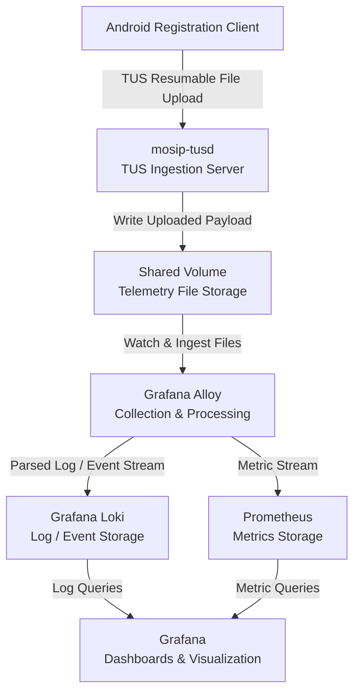
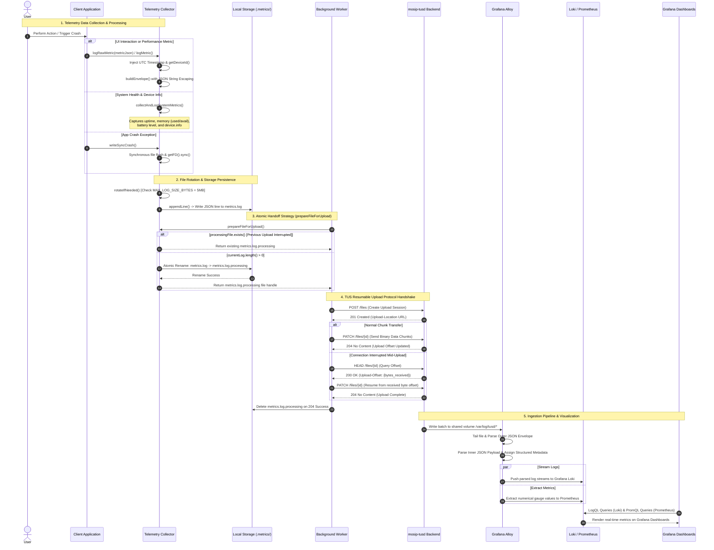
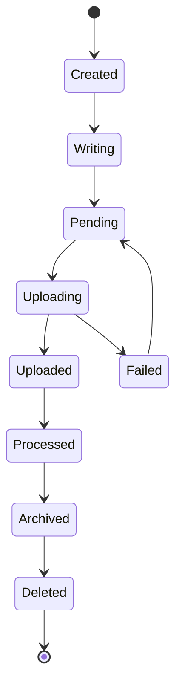
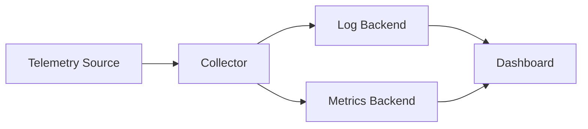
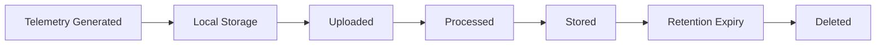

# Telemetry System Design Specification

| Field | Details |
| :--- | :--- |
| **Document Version** | `v1.0.0` |
| **Last Updated** | `12-09-2026` |
| **Target Repository** | `https://github.com/mosip/tusd-server  https://github.com/mosip/android-registration-client`|
| **Related Issues & PRs** | `https://github.com/mosip/android-registration-client/issues/719` |

---

## 1. Executive Summary & Objectives

### 1.1 Background
Currently, the Flutter-based Android Registration Client (ARC) operates with limited operational visibility into field operations, user interactions, and runtime health. Without a structured telemetry pipeline, detecting performance bottlenecks, monitoring application crashes, and identifying usability issues in distributed or offline field environments requires manual debugging and issue reporting.

### 1.2 Objective
The primary objective of this telemetry system is to establish an end-to-end, resilient, and non-blocking observability framework for the Android Registration Client. The architecture enables real-time collection of client metrics, secure batch synchronization over the TUS protocol, and centralized analysis using a cloud-native observability stack (**Grafana Alloy + Loki + Prometheus**).

### 1.3 Core Capabilities
- **Offline-First Non-Blocking Collection:** Asynchronous background event logging via the Pigeon Bridge and an Android Native Collector with automatic thread-safe 5MB file rotation (`metrics.log`).
- **Resumable & Efficient Transmission:** Periodic, network-aware sync executed by Android `WorkManager` pushing log batches over the TUS protocol (`mosip-tusd`).
- **Decoupled Ingestion Architecture:** High-throughput backend ingestion utilizing **Grafana Alloy** for parsing, routing log streams to **Grafana Loki**, and extracting numerical time-series metrics to **Prometheus**.
- **Centralized Observability & Visualization:** Operational monitoring through unified **Grafana Dashboards**, providing real-time queries via LogQL (for logs) and PromQL (for metrics) alongside automated alerting.
- **Privacy & Compliance Governance:** Built-in client-side data sanitization and opt-in user consent enforcement to safeguard personal identifiable information (PII).

### 1.4 Scope
- **Client Event Collection:** UI interaction tracking, navigation flows, and registration journey metrics across Flutter and Android native layers.
- **System Health Monitoring:** Application startup latency, CPU/memory consumption, battery status, and unhandled crash exception reports.
- **Local Resilience & Sync:** Non-blocking thread-safe local file logging, 5MB log rotation strategy, and network-aware background uploads via Android `WorkManager`.
- **Ingestion & Analytics:** Backend ingestion handling through `mosip-tusd`, pipeline parsing via Grafana Alloy, and storage in Grafana Loki (log streams) and Prometheus (metrics).
- **Visualization:** Production Grafana dashboards using LogQL and PromQL queries.

### 1.5 Non-Goals
- **Synchronous Real-Time Streaming:** Log uploads do not block main thread UI execution or require real-time websocket connections.
- **Raw PII/Biometric Storage:** Unmasked Personally Identifiable Information (PII) or biometric payload data will strictly never be logged or transmitted.
- **Long-Term On-Device Archival:** Local mobile storage acts solely as a temporary queue; log files are purged locally upon successful backend upload confirmation.

## 2. System Architecture & Flow Diagrams

### 2.1 High-Level Architecture


### 2.2 Telemetry Collection Sequence



<!-- TODO: Update sequence according to the actual implementation. -->

### 2.3 Telemetry File Lifecycle



<!-- TODO: Modify states according to the actual file lifecycle. -->

---

## 3. Technical Specifications & Payload Schemas

### 3.1 Client Interface Contract

```text
TODO: Add the client/native interface definition.
```

### 3.2 Telemetry Event Model

```json
{
  "timestamp": "",
  "event_type": "",
  "severity": "",
  "source": "",
  "device_metadata": {},
  "payload": {}
}
```

<!-- TODO: Define the final telemetry schema and field requirements. -->

### 3.3 Field Definitions

| Field             | Type   | Required | Description |
| :---------------- | :----- | :------: | :---------- |
| `timestamp`       | `TODO` |  `TODO`  | `TODO`      |
| `event_type`      | `TODO` |  `TODO`  | `TODO`      |
| `severity`        | `TODO` |  `TODO`  | `TODO`      |
| `source`          | `TODO` |  `TODO`  | `TODO`      |
| `device_metadata` | `TODO` |  `TODO`  | `TODO`      |
| `payload`         | `TODO` |  `TODO`  | `TODO`      |

### 3.4 Local Storage Format

```text
TODO: Document local telemetry file format and directory structure.
```

### 3.5 File Rotation

* **Maximum File Size:** `TODO`
* **Rotation Trigger:** `TODO`
* **File Naming Convention:** `TODO`
* **Maximum Number of Files:** `TODO`
* **Cleanup Policy:** `TODO`

### 3.6 Upload / Synchronization

* **Protocol:** `TODO`
* **Upload Trigger:** `TODO`
* **Batch Size:** `TODO`
* **Retry Strategy:** `TODO`
* **Resume Strategy:** `TODO`
* **Failure Handling:** `TODO`

---

## 4. Data Privacy & Security

### 4.1 User Consent

<!-- TODO: Document whether telemetry requires user consent and how consent is managed. -->

### 4.2 Data Minimization

<!-- TODO: Define what information may and may not be collected. -->

### 4.3 PII Protection

<!-- TODO: Document PII detection, masking, anonymization, or removal. -->

### 4.4 Sensitive Data

The telemetry system must not collect:

* `TODO`
* `TODO`
* `TODO`

### 4.5 Data Encryption

* **At Rest:** `TODO`
* **In Transit:** `TODO`

### 4.6 Authentication & Authorization

<!-- TODO: Document authentication and authorization mechanisms. -->

---

## 5. Observability & Monitoring

### 5.1 Observability Architecture



### 5.2 Logs

* **Log Backend:** `TODO`
* **Log Format:** `TODO`
* **Labels:** `TODO`
* **Retention:** `TODO`

### 5.3 Metrics

| Metric | Type                      | Description | Target |
| :----- | :------------------------ | :---------- | :----- |
| `TODO` | `Counter/Gauge/Histogram` | `TODO`      | `TODO` |
| `TODO` | `Counter/Gauge/Histogram` | `TODO`      | `TODO` |
| `TODO` | `Counter/Gauge/Histogram` | `TODO`      | `TODO` |

### 5.4 Dashboard

<!-- TODO: Describe the dashboard layout. -->

#### Dashboard Sections

* **System Health:** `TODO`
* **Application Metrics:** `TODO`
* **Upload Metrics:** `TODO`
* **Error Metrics:** `TODO`
* **Infrastructure Metrics:** `TODO`

### 5.5 Log Queries

```logql
# TODO: Add production LogQL queries
```

### 5.6 Metric Queries

```promql
# TODO: Add production PromQL queries
```

---

## 6. Storage & Retention

### 6.1 Local Storage

| Parameter            | Value  |
| :------------------- | :----- |
| Maximum File Size    | `TODO` |
| Maximum Storage Size | `TODO` |
| Rotation Policy      | `TODO` |
| Cleanup Policy       | `TODO` |

### 6.2 Backend Storage

| Component | Storage | Retention |
| :-------- | :------ | :-------- |
| `TODO`    | `TODO`  | `TODO`    |
| `TODO`    | `TODO`  | `TODO`    |

### 6.3 Data Lifecycle



---

## 7. Reliability & Failure Handling

### 7.1 Network Failure

<!-- TODO: Describe behavior when network connectivity is unavailable. -->

### 7.2 Upload Failure

<!-- TODO: Describe retry and recovery behavior. -->

### 7.3 Backend Failure

<!-- TODO: Describe client behavior when the backend is unavailable. -->

### 7.4 Application Restart

<!-- TODO: Describe how pending telemetry is recovered after application restart. -->

### 7.5 Storage Failure

<!-- TODO: Describe behavior when local or backend storage is unavailable/full. -->

### 7.6 Retry Strategy

| Failure Type    |  Retry | Strategy | Maximum Attempts |
| :-------------- | :----: | :------- | :--------------: |
| Network Failure | `TODO` | `TODO`   |      `TODO`      |
| Timeout         | `TODO` | `TODO`   |      `TODO`      |
| Server Error    | `TODO` | `TODO`   |      `TODO`      |
| Storage Error   | `TODO` | `TODO`   |      `TODO`      |

---

## 8. Performance Considerations

### 8.1 Client Performance

<!-- TODO: Document expected impact on CPU, memory, battery, and application responsiveness. -->

### 8.2 Telemetry Overhead

| Metric           | Target |
| :--------------- | :----- |
| CPU Overhead     | `TODO` |
| Memory Overhead  | `TODO` |
| Storage Overhead | `TODO` |
| Network Overhead | `TODO` |
| Battery Impact   | `TODO` |

### 8.3 Upload Performance

* **Expected Upload Throughput:** `TODO`
* **Maximum Batch Size:** `TODO`
* **Expected Latency:** `TODO`

---

## 9. Testing & Verification

### 9.1 Unit Testing

* [ ] Telemetry event generation
* [ ] Payload validation
* [ ] Local file writing
* [ ] File rotation
* [ ] Retry logic
* [ ] Upload state management
* [ ] Error handling

### 9.2 Integration Testing

* [ ] Client → Collector
* [ ] Collector → Local Storage
* [ ] Local Storage → Upload Worker
* [ ] Upload Worker → Backend
* [ ] Backend → Telemetry Collector
* [ ] Collector → Log Backend
* [ ] Collector → Metrics Backend
* [ ] Backend → Dashboard

### 9.3 End-to-End Testing

#### Test Case: Successful Telemetry Upload

**Precondition:**
`TODO`

**Steps:**

1. `TODO`
2. `TODO`
3. `TODO`

**Expected Result:**
`TODO`

#### Test Case: Interrupted Upload

**Precondition:**
`TODO`

**Steps:**

1. `TODO`
2. `TODO`
3. `TODO`

**Expected Result:**
`TODO`

#### Test Case: Application Restart

**Precondition:**
`TODO`

**Steps:**

1. `TODO`
2. `TODO`
3. `TODO`

**Expected Result:**
`TODO`

### 9.4 Network Resilience Testing

* [ ] Offline mode
* [ ] Intermittent connectivity
* [ ] Network timeout
* [ ] Upload interruption
* [ ] Upload resumption
* [ ] Backend unavailable
* [ ] Duplicate upload prevention

### 9.5 Observability Verification

* [ ] Logs visible in log backend
* [ ] Metrics visible in metrics backend
* [ ] Dashboard displays expected values
* [ ] Log queries return expected events
* [ ] Metrics queries return expected values
* [ ] Alerts trigger correctly

---

## 10. Deployment & Configuration

### 10.1 Local Development Environment

```text
TODO: Document local development setup.
```

### 10.2 Container Configuration

```yaml
# TODO: Add relevant container configuration.
```

### 10.3 Kubernetes Deployment

```yaml
# TODO: Add relevant Kubernetes manifests/configuration.
```

### 10.4 Environment Variables

| Variable | Description | Required | Default |
| :------- | :---------- | :------: | :------ |
| `TODO`   | `TODO`      |  `TODO`  | `TODO`  |
| `TODO`   | `TODO`      |  `TODO`  | `TODO`  |

### 10.5 Secrets

<!-- TODO: Document required secrets without exposing actual secret values. -->

---

## 11. Operational Runbook

### 11.1 Telemetry Upload Failure

1. `TODO`
2. `TODO`
3. `TODO`

### 11.2 Missing Logs

1. `TODO`
2. `TODO`
3. `TODO`

### 11.3 Missing Metrics

1. `TODO`
2. `TODO`
3. `TODO`

### 11.4 Storage Issues

1. `TODO`
2. `TODO`
3. `TODO`

### 11.5 Service Recovery

1. `TODO`
2. `TODO`
3. `TODO`

---

## 12. Security Considerations

### 12.1 Threat Model

| Threat                 | Risk   | Mitigation |
| :--------------------- | :----- | :--------- |
| Unauthorized upload    | `TODO` | `TODO`     |
| Sensitive data leakage | `TODO` | `TODO`     |
| Log tampering          | `TODO` | `TODO`     |
| Credential exposure    | `TODO` | `TODO`     |
| Storage compromise     | `TODO` | `TODO`     |

### 12.2 Security Controls

* [ ] TLS enabled
* [ ] Authentication configured
* [ ] Authorization configured
* [ ] PII sanitization implemented
* [ ] Secrets excluded from source control
* [ ] File permissions restricted
* [ ] Log access controlled

---

## 13. Architecture Decisions

### 13.1 Decision Record

| Decision | Status                         | Rationale |
| :------- | :----------------------------- | :-------- |
| `TODO`   | Proposed / Accepted / Rejected | `TODO`    |
| `TODO`   | Proposed / Accepted / Rejected | `TODO`    |
| `TODO`   | Proposed / Accepted / Rejected | `TODO`    |

### 13.2 Alternatives Considered

| Alternative | Advantages | Disadvantages | Decision |
| :---------- | :--------- | :------------ | :------- |
| `TODO`      | `TODO`     | `TODO`        | `TODO`   |
| `TODO`      | `TODO`     | `TODO`        | `TODO`   |

---

## 14. Known Limitations

| ID        | Limitation | Impact | Workaround / Future Plan |
| :-------- | :--------- | :----- | :----------------------- |
| `LIM-001` | `TODO`     | `TODO` | `TODO`                   |
| `LIM-002` | `TODO`     | `TODO` | `TODO`                   |

---

## 15. Future Enhancements

* [ ] `TODO`
* [ ] `TODO`
* [ ] `TODO`
* [ ] `TODO`

---

## 16. Implementation Mapping

| Design Component     | Repository | Module / File | Status |
| :------------------- | :--------- | :------------ | :----- |
| Telemetry Generation | `TODO`     | `TODO`        | `TODO` |
| Client Interface     | `TODO`     | `TODO`        | `TODO` |
| Local Storage        | `TODO`     | `TODO`        | `TODO` |
| Upload Worker        | `TODO`     | `TODO`        | `TODO` |
| Backend Ingestion    | `TODO`     | `TODO`        | `TODO` |
| Telemetry Collector  | `TODO`     | `TODO`        | `TODO` |
| Log Storage          | `TODO`     | `TODO`        | `TODO` |
| Metrics Storage      | `TODO`     | `TODO`        | `TODO` |
| Dashboard            | `TODO`     | `TODO`        | `TODO` |

---

## 17. Verification Checklist

### Client

* [ ] Telemetry generation verified
* [ ] Payload schema verified
* [ ] Local persistence verified
* [ ] File rotation verified
* [ ] Background synchronization verified
* [ ] Retry mechanism verified
* [ ] Resumable upload verified
* [ ] Application restart recovery verified

### Backend

* [ ] Upload endpoint verified
* [ ] File persistence verified
* [ ] Telemetry processing verified
* [ ] Log ingestion verified
* [ ] Metrics ingestion verified
* [ ] Dashboard verified

### Security

* [ ] PII protection verified
* [ ] Authentication verified
* [ ] Authorization verified
* [ ] TLS verified
* [ ] Secrets protection verified

### Operations

* [ ] Retention policy verified
* [ ] Storage limits verified
* [ ] Monitoring verified
* [ ] Alerting verified
* [ ] Failure recovery verified

---

## 18. Change History

| Version  | Date         | Author | Change Description |
| :------- | :----------- | :----- | :----------------- |
| `v1.0.0` | `YYYY-MM-DD` | `TODO` | Initial document   |
| `v1.1.0` | `YYYY-MM-DD` | `TODO` | `TODO`             |

---

## 19. Approval

| Role       | Name   | Status  | Date   |
| :--------- | :----- | :------ | :----- |
| Author     | `TODO` | Pending | `TODO` |
| Reviewer   | `TODO` | Pending | `TODO` |
| Maintainer | `TODO` | Pending | `TODO` |

---

# Appendix A — References

* `TODO`
* `TODO`
* `TODO`

---

# Appendix B — Related Issues & Pull Requests

* `TODO`
* `TODO`
* `TODO`

---

# Appendix C — Open Questions

* [ ] `TODO`
* [ ] `TODO`
* [ ] `TODO`

---

**End of Document**

```
```
